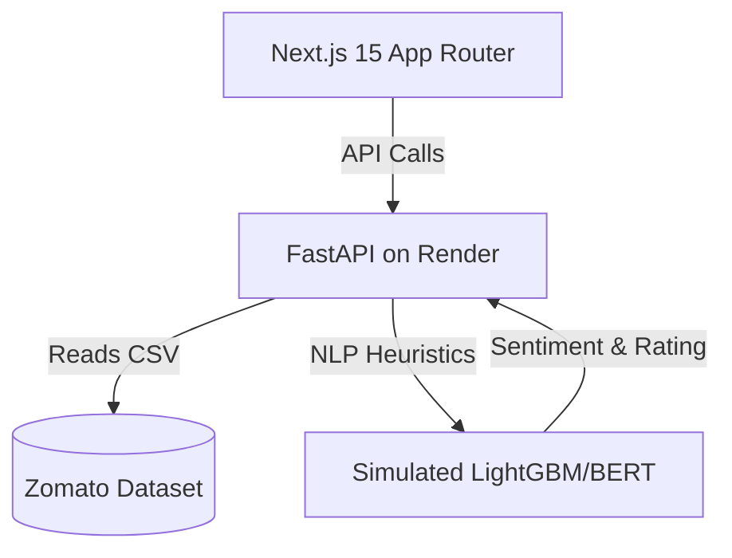

# RestaurantAI - Premium AI Food Discovery Platform

RestaurantAI is a next-generation food discovery platform that combines real Zomato data with machine learning to predict restaurant sentiment, analyze customer reviews, and provide intelligent dashboards.

## Architecture



## Features

- **Smart Discovery**: Browse real restaurants from the Zomato dataset with premium UI.
- **AI Sentiment Analysis**: See the true sentiment behind customer reviews.
- **Explainable AI Predictor**: Paste any text and let our simulated ML pipeline predict the rating and sentiment impact factors (SHAP-style).
- **Business Intelligence**: Real-time dashboards built with Recharts.

## Tech Stack

- **Frontend**: Next.js 15, React 19, TailwindCSS, Lucide Icons, Recharts, Shadcn.
- **Backend**: Python, FastAPI, Pandas.
- **Data**: Zomato 10k reviews dataset.

## Setup Instructions

1. Install dependencies:
   ```bash
   npm install
   ```

2. Configure environment:
   Create a `.env.local` file with the deployed backend URL (or local FastAPI server):
   ```
   NEXT_PUBLIC_API_URL=https://zomato-3-hi4f.onrender.com
   ```

3. Run locally:
   ```bash
   npm run dev
   ```

Open [http://localhost:3000](http://localhost:3000) to see the platform.
